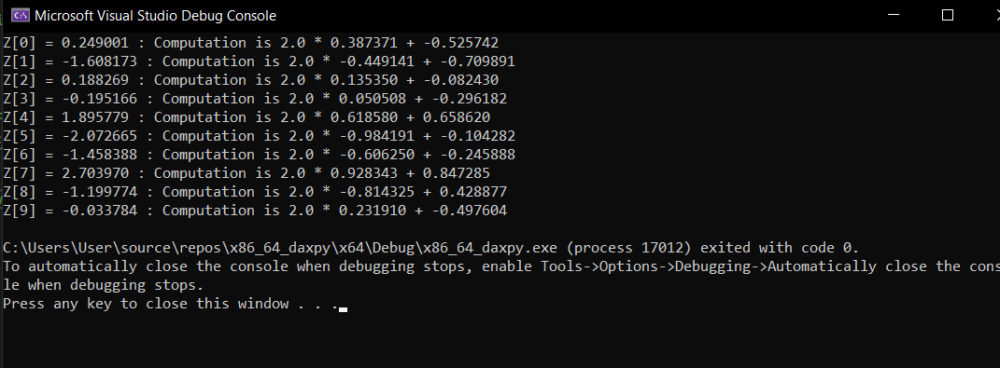

# LBYARCH_MP2
Programming project number 2 for LBYARCH Year 2023-2024 made by Josh Dane Villavicencio and Steven Aaron Yu of section S15.

## Project Specification Overview
The specification mentioned that this project should contain a C kernel and an ASM kernel performing this function DAXPY (A*X+Y).

It is also noted that SIMD registers and scalar functions are to be used as inputs, otherwise a grade of 0 will be given. 

Through this process:

Z[i] = A * X[i] + Y[i]

It is noted that:
Scalar variable A is a double-precision float and vectors X, Y, Z are also double-precision floats. 

The output is vector Z where the first 10 results are shown. 

NOTE: All results for the different runs may be different since random numbers are set as the variables instead. 

## Process of Running and Testing

At first, the program is ran once in C and in Assembly to see if the computations with different vectors are done right. 
The average time is gathered by performing 30 runs separately and manually getting the average of all the runs. This is done for the C and ASM versions.

Two separate runs are also gathered. These two runs are the debugged code and the compiling without debugging code. 

DISCLAIMER: Please do not make a function / for loop that makes the machine compute for it 30 times, it will make your CPU performance reach 97% since it will compute for the function 180 times (90 computations for C and 90 for ASM with each computing for 2^20, 2^24, and 2^27), so I did not push through with that when gathering data. 

## Sanity Checking

During one of the testing periods, one of our sanity checkers is the manual showing of the data of X[i] and Y[i], which are manually computed to see if the results are correct.
If the results of the C one is correct, it is compared to the ASM results. If they are the same... then the sanity checker has passed. 

## Average Running Time 

All of these have been run 30 times and the average time was gathered. 

C and ASM Average Time with Debugging:
|  TEST  |  C AVERAGE TIME  |  ASSEMBLY AVERAGE TIME  | 
| ------------- | ------------- | ------------- |
|  2^20  |  0.003125 seconds  |  0.003125 seconds  |
|  2^24  |  0.045250 seconds  |  0.045250 seconds  |
|  2^27  |  0.325650 seconds  |  0.325650 seconds  |

C and ASM Average Time without Debugging:
|  TEST  |  C AVERAGE TIME  |  ASSEMBLY AVERAGE TIME  | 
| ------------- | ------------- | ------------- |
|  2^20  |  0.003000 seconds  |  0.003000 seconds  |
|  2^24  |  0.037850 seconds  |  0.037850 seconds  |
|  2^27  |  0.305400 seconds  |  0.305400 seconds  |

## Observations and Analysis
1. Since the data here are randomized, both all runs have different running times, which could result the average in an either higher or lower result.
2. Whether the user is able to debug the code or not, they have relatively same amount of average runnning time. But during the runs, not debugging the code had a faster average time.
3. Both C and the ASM code have the same running time despite both have different functions. Maybe the code in assembly code is very very similar to the C version...  

## Where is the Code?
It is on x86_64_daxpy where main.c is the main C function and daxpy.asm is the ASM file

## Screenshots
The final version of sanity check used. This involves computing things manually and comparing it to the results of ASM

The early version of sanity check used. This involves computing things manually in C. This is a test of the random number generator here.

A successful run!

